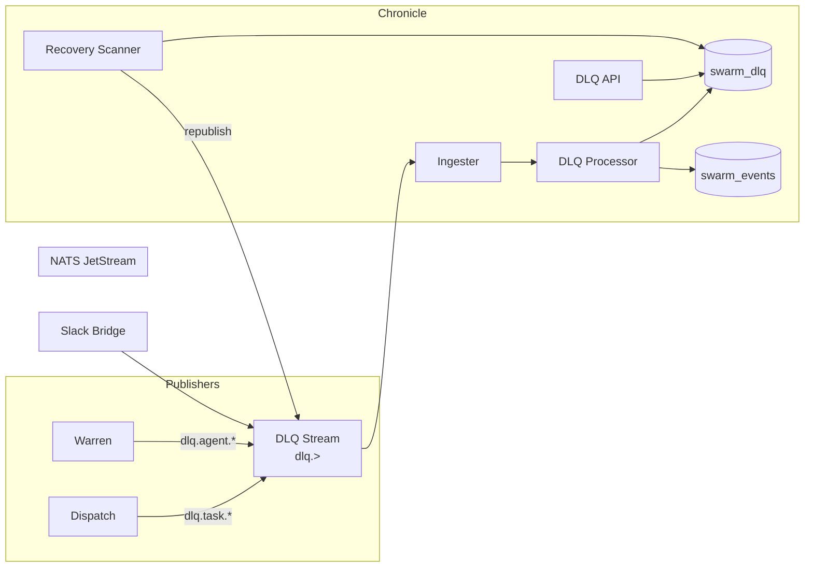
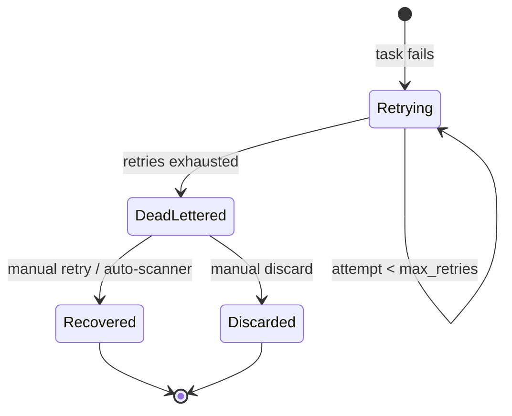
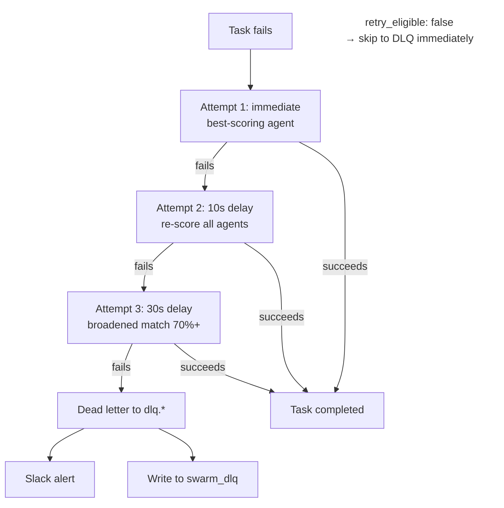
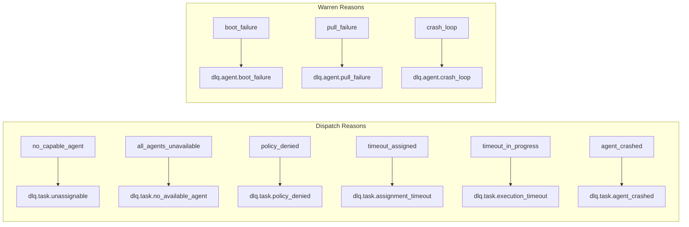
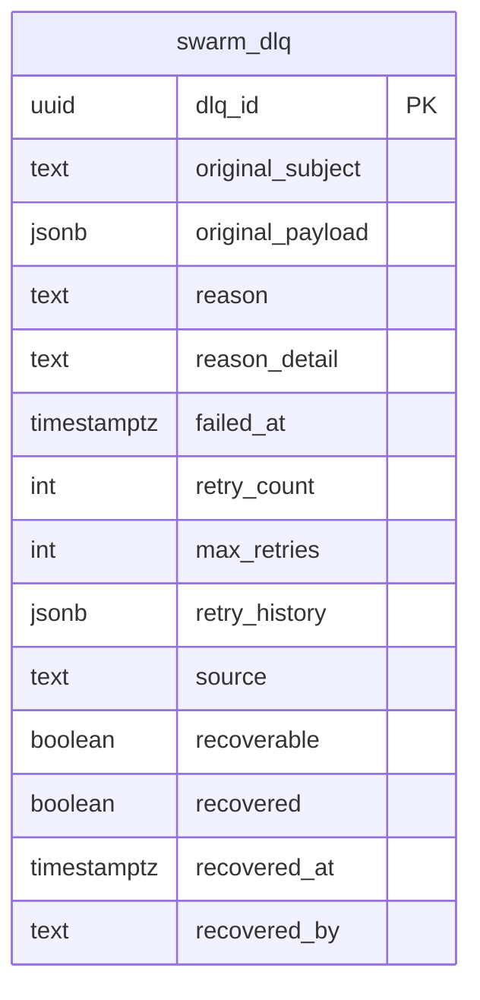
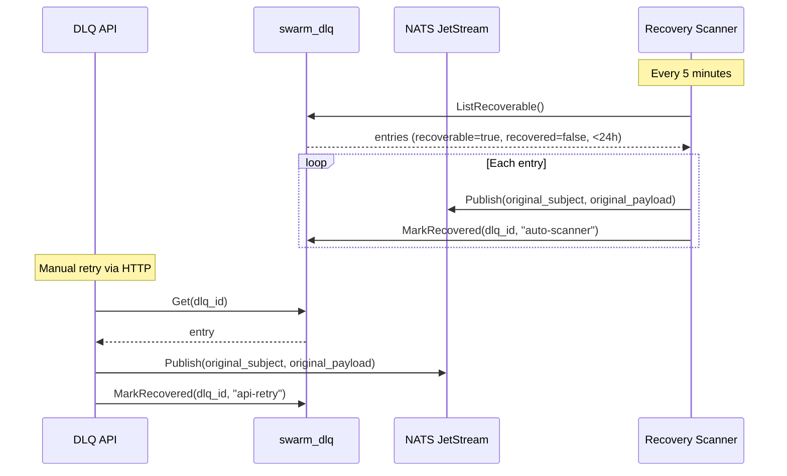
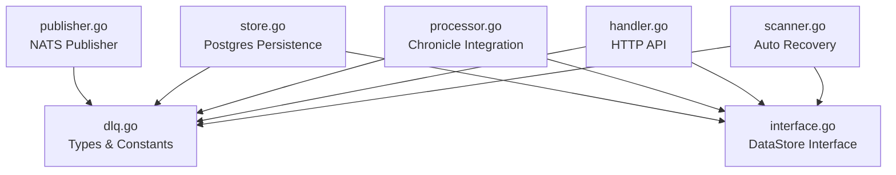

# swarm-dlq

Shared Dead Letter Queue library for the swarm. Provides types, a NATS publisher, Postgres persistence, HTTP management API, and an automated recovery scanner.

This is not a standalone service — it's a Go library imported by Dispatch (publisher), Warren (publisher), and Chronicle (consumer/persistence/API).

## Architecture



## DLQ Event Lifecycle



## Retry Strategy



## NATS Subject Routing



## Data Model



## Recovery Flow



## Component Dependency



## Installation

```go
import dlq "github.com/DarlingtonDeveloper/swarm-dlq"
```

## Usage

### Publishing (Dispatch / Warren)

```go
pub := dlq.NewPublisher(natsConn, dlq.SourceDispatch)

err := pub.Publish(dlq.PublishOpts{
    OriginalSubject: "swarm.task.request",
    OriginalPayload: originalTaskJSON,
    Reason:          dlq.ReasonNoCapableAgent,
    ReasonDetail:    "No agent with capabilities [research, competitor-analysis]",
    RetryCount:      3,
    MaxRetries:      3,
    RetryHistory:    retryAttempts,
    Recoverable:     true,
})
```

### Consuming (Chronicle)

```go
// Create DLQ store from existing pgx pool.
dlqStore := dlq.NewStore(pool)

// Create processor for Chronicle's ingester.
dlqProc := dlq.NewProcessor(dlqStore)

// On every dlq.> message:
dlqProc.Process(ctx, msg.Subject(), msg.Data())
```

### HTTP API (Chronicle)

```go
dlqHandler := dlq.NewHandler(dlqStore, natsConn)

router.Mount("/api/v1/dlq", dlqHandler.Routes())
```

### Recovery Scanner

```go
scanner := dlq.NewScanner(dlqStore, natsConn, 5*time.Minute)
scanner.Start(ctx)
```

## API Endpoints

Mount under `/api/v1/dlq` on your router.

| Method | Path | Description |
|--------|------|-------------|
| GET | `/` | List entries. Filter: `?recovered=false&reason=X&source=X&limit=N` |
| GET | `/stats` | Summary counts by reason and source |
| GET | `/{dlqID}` | Single entry with full payload and retry history |
| POST | `/{dlqID}/retry` | Republish original payload and mark recovered |
| POST | `/{dlqID}/discard` | Mark as discarded without retrying |
| POST | `/retry-all` | Retry all recoverable entries (last 24h) |

## DLQ Reasons

### From Dispatch (`dlq.task.*`)

| Reason | Subject | Trigger |
|--------|---------|---------|
| `no_capable_agent` | `dlq.task.unassignable` | No agent has required capabilities |
| `all_agents_unavailable` | `dlq.task.no_available_agent` | Capable agents exist but all busy/sleeping |
| `policy_denied` | `dlq.task.policy_denied` | Alexandria denies access |
| `timeout_assigned` | `dlq.task.assignment_timeout` | Agent never started the task |
| `timeout_in_progress` | `dlq.task.execution_timeout` | Task never completed |
| `agent_crashed` | `dlq.task.agent_crashed` | Agent died mid-task |

### From Warren (`dlq.agent.*`)

| Reason | Subject | Trigger |
|--------|---------|---------|
| `boot_failure` | `dlq.agent.boot_failure` | 3 consecutive health check failures |
| `pull_failure` | `dlq.agent.pull_failure` | Failed to pull soul/auth during boot |
| `crash_loop` | `dlq.agent.crash_loop` | 5+ restarts in 10 minutes |

## Database

```sql
-- See migrations/001_swarm_dlq.sql
```

## Testing

```bash
# Unit tests (40 tests)
go test ./... -v

# Integration tests (requires Postgres with swarm_dlq table)
DATABASE_URL=... go test ./... -v
```

### Test Coverage

| Package | Tests | Coverage |
|---------|-------|----------|
| `dlq_test.go` | 4 | Subject routing, entry defaults |
| `handler_test.go` | 20 | All 6 HTTP endpoints, error paths |
| `processor_test.go` | 7 | Process(), source inference, error paths |
| `scanner_test.go` | 7 | Scan recovery, start/stop lifecycle, error paths |
| `publisher_test.go` | 2 | Marshal round-trip, constructor |
| `e2e_test.go` | 4 | Full lifecycle, discard, scanner recovery, retry-all |
| `store_integration_test.go` | 5 | Insert, list, filter, recover, stats (requires DB) |
